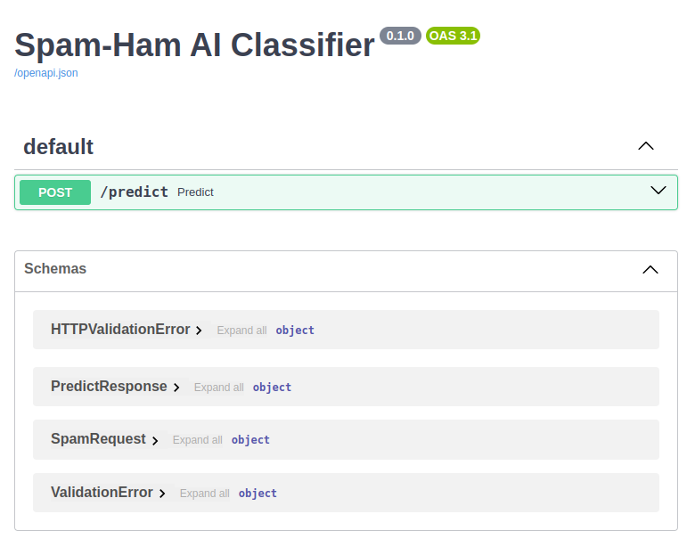
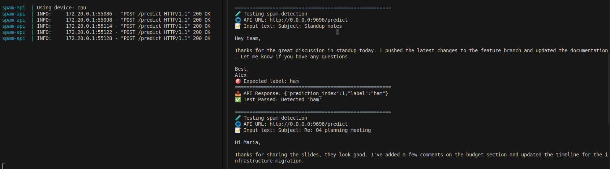

# SMS Spam Detection

This project addresses the problem of spam detection using machine learning and
deep learning techniques. A labeled dataset of text messages is analyzed and
preprocessed, followed by feature extraction using multiple text representations.
Several classification models are trained and evaluated to distinguish between
spam and legitimate messages. The models are compared using standard performance
metrics, highlighting their strengths and limitations. The results demonstrate
that machine learning-based approaches can effectively identify spam messages
and provide reliable performance on unseen data

## REST API

This project exposes a small REST API (FastAPI) for spam/ham predictions.

Once the app is running, the API is available at:

- `http://localhost:9696`

### `POST /predict`

Classifies a text as `spam` or `ham`.

- **Request body** (JSON):
	- `text` (string)
- **Response** (JSON):
	- `prediction_index` (int)
	- `label` (`spam` | `ham`)

Example:

```sh
curl -X POST "http://localhost:9696/predict" \
	-H 'Content-Type: application/json' \
	-d '{"text":"Free entry in 2 a wkly comp to win FA Cup final tkts"}'
```

### API docs screenshot



## Docker Setup

The project is designed to run locally via Docker Compose and a `.env`
configuration described in the `.spam-api.docker.env` file.

Start:

```sh
docker compose up --build
```

Stop:

```sh
docker compose down
```

After startup, interact with the API at `http://localhost:9696`.

## Endpoint validation

Minimal endpoint validation is done by calling the running API and checking that
the returned label matches expectations (via a bash script).

- Script: `tests/test_api.sh`

Run it (with the API already running):

```sh
bash tests/test_api.sh
```

### Test run results



